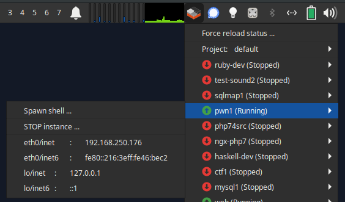

# python-lxd-gtk-indicator
Having fun w/ python + gtk + lxd .

## whatis 

Pops up gtk-ish indicator in the "system tray". 
When clicked - shows list of containers on LXD instance + red/green indicator.
When clicked on container - popup dialog box w/ network configuration of this container.

